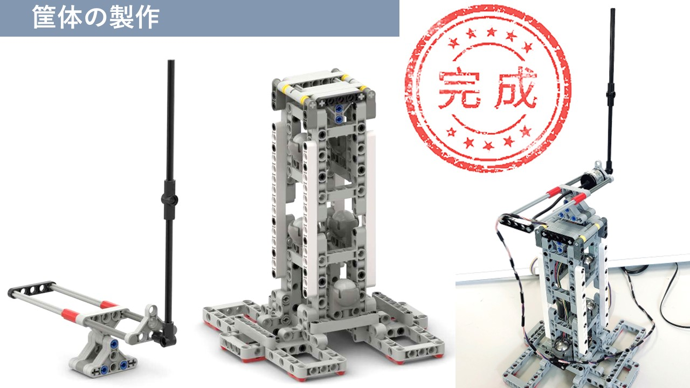

# LEGO 部品を筐体とした回転型倒立振子

[YouTube「かーたー」チャンネル](https://www.youtube.com/channel/UCQxZZypRXCsvALuvmWy68jw)

ぼちぼちと更新していきますね！

## 回転型倒立振子の製作

## 回転型倒立振子の数学モデル
　Lagrange の運動方程式を利用すると，

$$
\begin{array}{l}
\bigl( J_1 + m_1 L_1^2 + J_2\sin^2\theta_2\bigr)\ddot{\theta}_1 + m_2 L_1 l_2\cos\theta_2\cdot\ddot{\theta}_2
= \tau_1 - 2J_2\dot{\theta}_1\dot{\theta}_2\sin\theta_1 \cos\theta_1 + m_2 L_1 l_2 \dot{\theta}_1^2 \sin \theta_1 - c_1 \dot{\theta}_1 \\
m_2 L_1 l_2 \cos\theta_2 \cdot \ddot{\theta}_1 + J_2 \ddot{\theta}_2
= J_2 \dot{\theta}_1^2 \sin\theta_2 \cos\theta_2 + m_2 g l_2 \sin\theta_2 - c_2\dot{\theta}_2
\end{array}
$$

が得られます．

